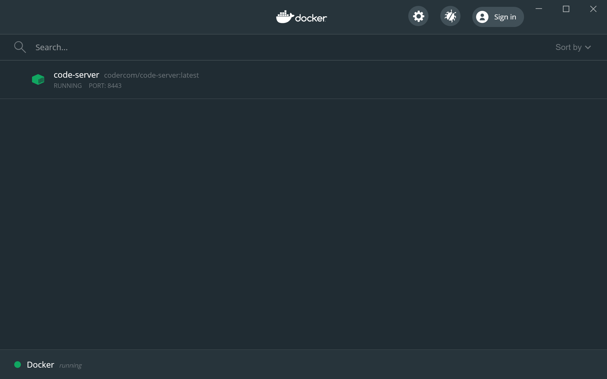

# WSL2 Environment

## Installation

1. Activate WSL2 feature on Windows 10 (if you haven't yet)
2. Install Ubuntu from Microsoft Store
3. Restart Windows twice (I don't know why this is needed)
4. Launch Ubuntu and let it start the initialization
5. Install [Docker Desktop for Windows](https://hub.docker.com/editions/community/docker-ce-desktop-windows/)

## Preparation

Open bash terminal (on Ubuntu).

Make sure you have `.ssh` dir:

```bash
$ mkdir -p ~/.ssh
```

Add your private key into the dir. Don't forget to change its permition to `600`.

Then, add some configuration to Git:

```bash
$ git config --global user.name "John Doh"
$ git config --global user.email "john.doh@example.com"
```

## Setting up Applications

### code-server

```bash
$ bash code-server/up
```

Open http://localhost:8443 from your browser on Windows 10.

## Docker container management

The container which `run` from Ubuntu is accessible from Docker Desktop. So, just open "Dashboard" of Docker Desktop *on Windows*.


